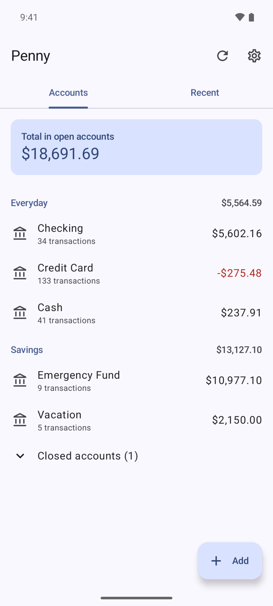
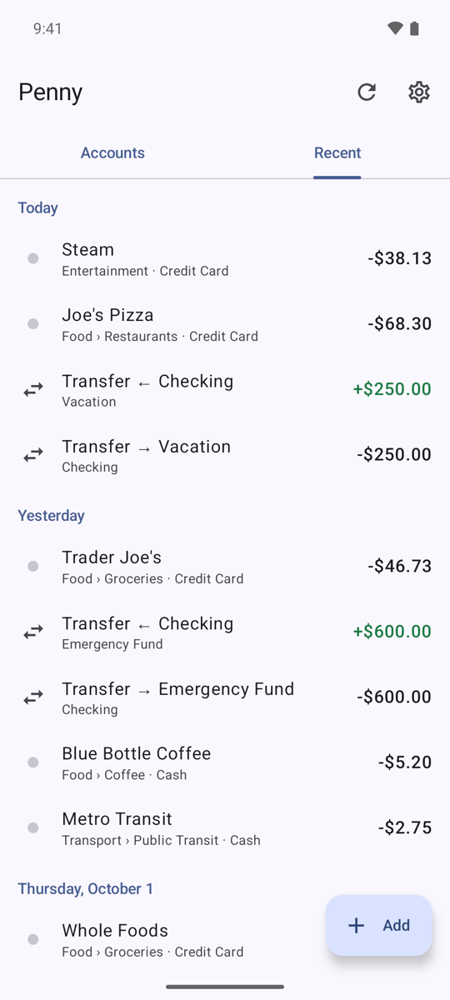
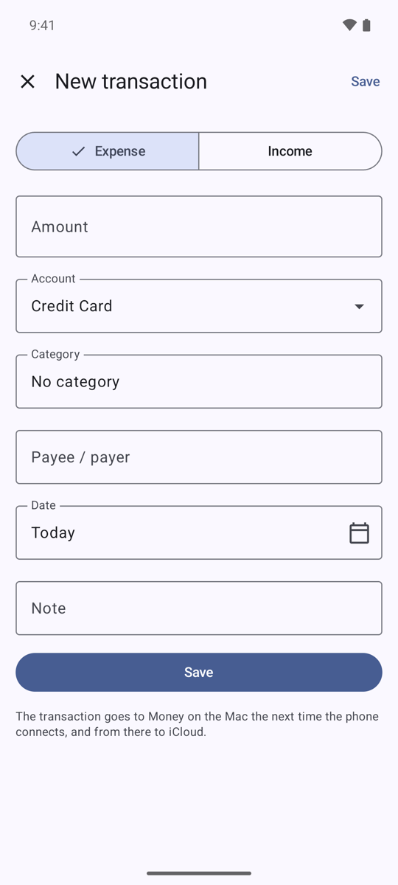

# Penny

An Android app for viewing and adding transactions in **Money** (Jumsoft), synced through iCloud.

<p align="center">
  
  
  
</p>

## How it works

Money keeps its data in a private **CloudKit** database (`iCloud.com.jumsoft.money`), not as a file on iCloud Drive.
Apple doesn't open that database to apps outside its ecosystem, so Android can't read it directly.
Penny uses a Mac as a bridge:

```
Android (Penny) ⇄ Wi-Fi ⇄ penny-bridge (Mac) ⇄ local Money database ⇄ Money.app ⇄ iCloud ⇄ iPhone/iPad
```

- **Reading:** `penny-bridge` reads Money's local database (Core Data/SQLite) using the data model loaded straight from Money.app.
- **Writing:** the bridge quits Money, makes a backup, adds the transaction to Money's database and registers it in the
  SyncKit change log (state "new"), the same way Money does. Then it relaunches Money in the background. Money uploads
  the transaction to iCloud on its next sync, and from there it reaches your other devices.
- New transactions copy their technical fields (`transactionType`, split type, flags) from the most recent similar
  transaction saved by Money, so they look the same as ones entered by hand.
- The phone keeps an offline queue: transactions added away from home wait and are sent once you're back on Wi-Fi.

## Installing on the Mac

Requirements: macOS 14+, Money 9 with iCloud sync turned on, Xcode Command Line Tools.

```bash
cd bridge
swift build -c release
.build/release/penny-bridge selftest     # test on a throwaway database, never touches Money's data
.build/release/penny-bridge install      # installs a service that starts at login
```

Then:

1. System Settings → Privacy & Security → **Full Disk Access** → "+" → `Cmd+Shift+G` →
   `~/Library/Application Support/PennyBridge/bin/penny-bridge`. Access has to be granted again after every
   reinstall, because macOS identifies the program by its signature.
2. Restart the service: `launchctl kickstart -k gui/$(id -u)/app.penny.bridge`
3. Check: `~/Library/Application\ Support/PennyBridge/bin/penny-bridge doctor`
4. If macOS asks about incoming connections or local network access, allow it.

Service log: `~/Library/Logs/PennyBridge.log`. Database backups taken before every write:
`~/Library/Application Support/PennyBridge/backups/` (the last 30).

## Installing on Android

```bash
cd android
./gradlew assembleRelease
adb install app/build/outputs/apk/release/app-release.apk
```

On first launch Penny looks for the Mac on the network (Bonjour). After choosing the Mac, run
`penny-bridge pair` on it and enter the 6-digit code it shows on the phone.

### App settings

The settings screen (gear icon on the main screen) offers:

- **Theme:** system default, light or dark.
- **Accounts:** hide chosen Money folders (e.g. an archive folder). Their accounts disappear from the main screen,
  the totals and the account picker. Hiding follows the folder, so renaming it in Money doesn't matter. This needs
  a bridge that sends folder IDs; with an older one, settings asks to update it.
- **Language:** system default, English or Polish. On Android 13+ the language can also be changed in the system
  settings (Apps → Penny → Language).
- **App lock:** a 4–8 digit PIN required to open Penny, optionally with biometric unlock (fingerprint/face, Class 3
  only). Biometrics can also be the whole lock, without a PIN; the phone's screen lock is then the fallback
  (Android 11+). The app locks on start and after being in the background for the chosen time. After 5 wrong PINs, entry is
  blocked for a while, and the delay grows with further mistakes. A forgotten PIN can be reset, which disconnects the
  phone from the Mac and removes downloaded data (pending transactions are kept).
- **Mac:** the connected bridge and disconnecting from it.

## Bridge commands

| Command | Description |
|---|---|
| `penny-bridge pair` | phone pairing code (valid for 10 min) |
| `penny-bridge doctor [--verbose]` | diagnostics: database locations, detected conventions, balances |
| `penny-bridge devices` / `revoke NAME` | paired devices |
| `penny-bridge install` / `uninstall` | LaunchAgent service |
| `penny-bridge selftest` | write test on a throwaway database built from Money's model |
| `penny-bridge demo DIR` | database with made-up data, for screenshots and trying the app |

Configuration: `~/Library/Application Support/PennyBridge/config.json`, including `port`, `writesEnabled`
(turns writing off) and `launchMoneyAfterWrite`.

## Demo data

`penny-bridge demo DIR` builds a database in Money's format with made-up accounts and four months of transactions
(the screenshots above use it), plus a bridge configuration that serves it on port 8766 as "Penny Demo" without touching
Money.app. It needs Money.app installed, for the data model.

```bash
cd bridge && swift build
.build/debug/penny-bridge demo /tmp/penny-demo
PENNY_BRIDGE_HOME=/tmp/penny-demo/home .build/debug/penny-bridge serve
PENNY_BRIDGE_HOME=/tmp/penny-demo/home .build/debug/penny-bridge pair   # in another terminal
```

Transactions added from the phone are written to the demo database.

## Limitations

- The Mac has to be on and on the same network for the phone to fetch fresh data or send transactions.
- Local network traffic is unencrypted (HTTP + token). Use it on a trusted home network.
- Writing closes Money for a few seconds. When Money is frontmost (you're using it right now) or has an edit window
  open, the bridge defers the write and the phone retries later. This can be turned off with
  `deferWhileMoneyActive: false`.
- Only expenses and income with a single category are supported. Transfers between accounts, split transactions
  and editing existing transactions don't work yet.
- The balance of investment accounts is the cash balance only, without the value of securities.
- Money's data format isn't documented. The bridge checks that the model matches the installed Money version and refuses
  to write if it doesn't recognize the format. After updating Money, it's worth running `penny-bridge doctor`.

## Structure

- `bridge/`: Swift, no dependencies (Core Data, SQLite, Network.framework).
- `android/`: Kotlin, Jetpack Compose, Material 3, OkHttp, kotlinx.serialization, WorkManager, AppCompat (per-app
  language and theme), androidx.biometric.

## AI Disclaimer

Yes, the whole work was done with AI help.

## Author

Łukasz Bednarski

## License

MIT, see [LICENSE](LICENSE).
